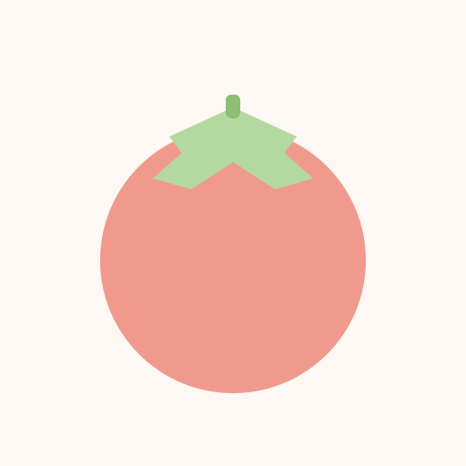
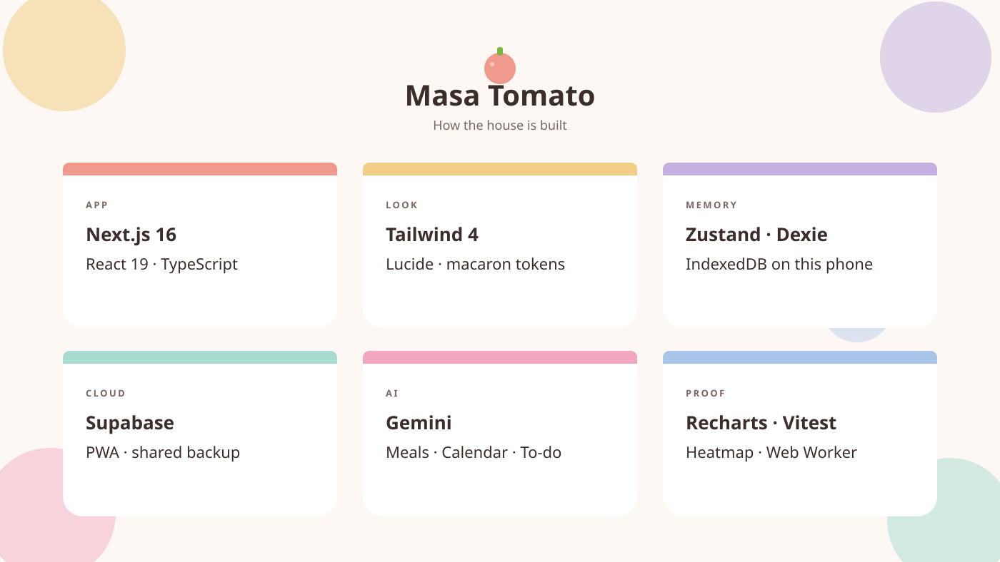

<div align="center">



# Masa Tomato

**A shared life dashboard for two people.**
Grew out of a Pomodoro timer. Still starts with one.

[](https://nextjs.org/)
[](https://react.dev/)
[](https://supabase.com/)
[](src/app/manifest.ts)

*Cream walls. One pastel per room. One password for the house.*

</div>

---

One home screen for Jeff and Rachel. You pick a name at the door, type the shared secret, and land on **today** — the weekday, what's on, how many focus minutes you've already banked, and eight coloured doors into the rest of the house.

---

## The house

Home is the front door. Everything else is a room.

| | Room | What you do | Status |
| :---: | --- | --- | :---: |
| 🍅 | **Study** | Drift-free Pomodoro, open stopwatch, heatmap + 2-player leaderboard | Live |
| 📅 | **Timetable** | Week grid, the day's itinerary, and a shared to-do list | Live |
| 🗓️ | **Calendar** | Shared events. Pin the ones that matter; they rotate on Home | Live |
| 💗 | **Period** | Cycle ring, calendar, symptoms — saved, not a mock | Live |
| ⏳ | **Countdown** | Dates you're counting down to, and days you're counting up | Live |
| 🍽️ | **Meals** | Snap a plate. The app guesses the dish; you confirm. A week can get a written review | Live |
| 💪 | **Fitness** | Styled preview. Nothing here saves yet | Preview |
| 💳 | **Finance** | Styled preview. Every figure is invented | Preview |

Study wears a **Timer / Flexible / Dashboard** pill. Timetable is the only room with a bottom bar — **Timetable / To-do**. A timer you leave running keeps ticking if you walk into another room.

Notes sit on top of every room (`N`, or the Home menu). Calendar and To-do have a helper that shows a plan before it touches anything. Study can play Spotify or YouTube, and wear your wallpaper — words always sit on a panel, never on the photo.

---

## How I built it

It started as a focus timer. The rest of the house grew around that clock, one room at a time, because we needed a shared place for the week — not another row of apps.

I built it **phone-first**. A timer that dies when the wifi drops is useless, so sessions, notes, and queued meal photos write to this device first (IndexedDB, through Dexie). Supabase is the shared backup. The leaderboard and the other rooms catch up when the network is there.

The countdown itself does not trust the browser tab. A **Web Worker** keeps the seconds honest while you are in another room, or the phone has put the page to sleep. The timer engine lives above every page, so walking from Study to Calendar does not reset the clock.

There are no accounts. Two names, one shared password, checked on the server. Five misses lock the door for fifteen minutes.

The look is one cream field and a pastel per room — the macaron palette. Dark mode exists in the tokens and is unused on purpose. Every route is light. Study is the only place with a wallpaper, and nothing writes words onto that photo.

Gemini reads a plate and drafts meal guesses. The same model sits behind the Calendar and To-do helper: it proposes, you confirm. Vitest guards the bits that must not drift — colours, dates, sync — as plain functions, not a fake browser.

It installs as a home-screen app. On Windows, `PomodoroOS.vbs` starts the server quietly and opens the browser.

---

## The stack

<div align="center">
  
</div>

| Layer | What I picked | Why |
| --- | --- | --- |
| **App** | Next.js 16 (App Router, Turbopack), React 19, TypeScript | One codebase for the house. Routes are real URLs — Study is `/study`, not a fake tab. |
| **Look** | Tailwind 4, Lucide, CSS tokens (`--mt-*`) | Cream field, one accent per room. No hardcoded colours in the UI. |
| **State** | Zustand | Timer settings and a few open/closed bits. Survives a refresh. |
| **This phone** | Dexie (IndexedDB), `idb-keyval` | Sessions, notes, queued meal photos, wallpapers. The timer works offline. |
| **Cloud** | Supabase (Postgres) | Shared backup and the 2-player leaderboard. The phone stays the source of truth. |
| **Clock** | Web Worker | The countdown does not freeze when the tab is backgrounded. |
| **AI** | Gemini | Meal guesses, plus the Calendar / To-do helper. |
| **Charts** | Recharts, react-activity-calendar | Dashboard bars and the GitHub-style heatmap. |
| **Motion** | react-rnd, dnd-kit | Floating music widgets; drag-to-reorder where a list needs it. |
| **Proof** | Vitest | Pure-function tests. Palette maths is asserted, not hoped. |

```
you type / tap  →  this phone (IndexedDB)  →  Supabase, when the network is there
```

---

<div align="center">

*Built for two. Open on a phone. Still a tomato.*

</div>
